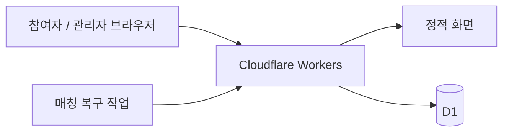
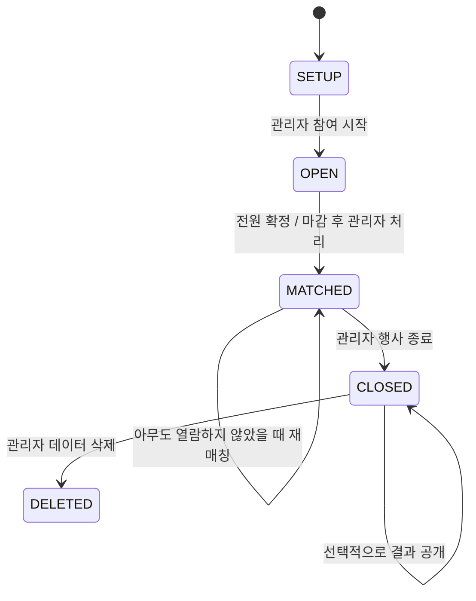

# 새해 목표 선물 교환 설계 v1.1

작성일: 2026-10-08 (Asia/Seoul). 상태: 구현 전 설계안.

## 1. 기준과 범위

원문 `gift-exchange-plan (1).md` v1.0의 단일 행사, 10~20명, 서버 매칭, Sattolo, 선물 번호, 확정 제출 잠금, 실물 카드, 종료 후 선택 공개 규칙을 기준으로 한다. 참여자 표시는 대화에서 변경된 닉네임 방식을 적용한다.

대화에서 추가된 요구사항은 Cloudflare 배포, D1 영구 저장, 관리자 확인 링크, 관리자 페이지에서 참석 인원 설정, 사용자가 직접 설정한 닉네임 표시다. 원문의 배포 전 명단 설정을 관리자 웹 설정으로 대체한다. 원문 파일은 수정하지 않는다.

이 문서는 기술·기능 설계이며 실제 사이트, D1, 비밀번호, 배포 리소스는 아직 생성하지 않는다. 아래의 참여 시작 단계, 명단 변경 규칙, 복구 방식은 구현을 위한 설계 제안이다.

매칭 후 참여자는 받는 사람의 닉네임과 목표를 확인한다. 자신에게 선물을 주는 산타의 닉네임과 전체 매칭 목록은 행사 종료 후 공개할 때 확인한다. ‘최종 매칭 상태 확인’은 공개 전에는 완료 여부와 열람 여부 확인, 공개 후에는 산타 닉네임 → 받는 사람 닉네임의 전체 목록 확인으로 해석한다. 관리자만 사전에 전체 명단을 보는 기능은 포함하지 않는다. 닉네임으로 상대를 알아볼 수 있으므로 완전한 익명성을 보장하는 서비스로 안내하지 않는다.

변경 기록: v1.1 — 참여자가 닉네임을 직접 입력하고 배정 상대와 공개 결과를 닉네임으로 표시하도록 화면·DB·API·검증 기준 변경.

## 2. 배포 및 기술 구성

| 영역 | 선택 | 목적 |
|---|---|---|
| 화면 | React + TypeScript + Vite | 모바일 중심 참여 화면과 관리자 화면 |
| 서버 | Cloudflare Workers + TypeScript | 인증, 제출, 매칭, 공개 처리 |
| 정적 파일 | Workers Static Assets | 화면과 API를 같은 주소에서 제공 |
| 저장 | Cloudflare D1 한 개 | 설정, 명단, 목표, 매칭, 세션 영구 저장 |
| 배포 도구 | Wrangler | 로컬 개발, DB 마이그레이션, 배포 |
| 복구 작업 | Worker Cron Trigger, 매분 | 전원 제출 후 미완료된 자동 매칭 재시도 |

배포 서버의 임시 파일에 SQLite 파일을 저장하지 않는다. 로컬 개발용 DB와 실제 운영 D1은 분리한다. 운영 연결 정보와 관리자 인증 관련 secret은 클라이언트 번들에 포함하지 않는다.

Workers Static Assets는 정적 파일과 Worker를 함께 배포할 수 있다. `/api/*`는 반드시 Worker에서 처리하고, SPA 경로는 화면을 반환한다. [공식 문서](https://developers.cloudflare.com/workers/static-assets/)

예상 사용량은 무료 플랜 내에서 운영 가능한 규모다. D1 무료 한도는 읽기 하루 500만 행, 쓰기 하루 10만 행, 계정 총 5GB이며 **DB 하나당 최대 500MB**다. 실제 운영 비용은 계정 플랜과 전체 사용량에 따른다. [요금](https://developers.cloudflare.com/d1/platform/pricing/), [제한](https://developers.cloudflare.com/d1/platform/limits/)

## 3. 주소와 화면

아래 주소는 경로 제안이며 아직 발급된 링크가 아니다. 배포 후 동일한 서비스 주소 뒤에 붙인다.

| 경로 | 화면 | 주요 내용 |
|---|---|---|
| `/` | 참여 안내 | 행사명, 예산, 마감, 참여하기, 코드로 재접속 |
| `/join` | 참여 등록 | 명단에서 본인 이름 선택, 닉네임 직접 입력, 목표 100자 이내, 임시저장 |
| `/access` | 재접속 | 접속 코드 입력 |
| `/me` | 내 페이지 | 내 닉네임·임시 목표 편집, 확정 제출, 대기, 내 선물 번호 |
| `/me`의 매칭 영역 | 배정 결과 | ‘배정 확인’ 후 받는 분의 닉네임·목표·번호, 교환 안내 |
| `/results` | 공개 결과 | 공개 후 인증된 참여자·관리자에게 닉네임 매칭 목록만 표시 |
| `/admin` | 관리자 로그인 및 대시보드 | 설정, 명단, 진행 현황, 운영 버튼 |

참여 전에는 명단을 공개하지 않는다. 참여 시작 후 등록 화면에는 명단과 등록 가능 여부만 제공하며 이름과 닉네임의 대응 관계는 제공하지 않는다. 모든 목표와 개인 번호는 인증 후 조회한다. 관리자 현황에는 운영을 위해 명단 이름과 해당 참여자의 닉네임을 함께 표시한다.

모바일에서 한 화면에 하나의 주요 동작을 둔다. 내 번호와 받는 분의 번호는 서로 다른 문구로 명확하게 표시한다. 접속 코드는 발급 직후 복사·보관 안내를 제공한다.

## 4. 관리자 설정과 인원 관리

### 최초 설정

1. 배포 운영자가 관리자 비밀번호 검증 값과 서버 secret을 설정한다.
2. 관리자는 `/admin`에 로그인한다.
3. 행사명, 목표 작성 마감, 예산 안내, 참석자 명단을 입력·저장한다.
4. 화면에 총인원과 설정 요약을 표시한다. **인원은 참석자 명단의 활성 이름 수로 계산한다.** 숫자만 설정하고 이름을 나중에 입력하는 별도 방식은 두지 않는다.
5. 관리자가 ‘참여 시작’을 누르면 참여 링크로 등록할 수 있다.

명단은 한 명씩 추가하거나 줄바꿈 목록으로 일괄 입력한다. 공백 제거 및 Unicode 정규화 후 같은 이름은 거부한다. 동명이인은 ‘민수 A’, ‘민수 B’처럼 구분해 입력한다. 최소 2명, 최대 99명이며 4명 미만 시작·매칭에는 선택 가능한 상대가 적다는 안내와 확인을 표시한다. 기본 예상 규모는 10~20명이다.

### 참여자가 설정하는 닉네임

- 명단 이름은 참여 자격을 확인하는 용도이고, 닉네임은 배정·공개 결과에 표시하는 용도다. 명단 선택 방식과 사칭 위험에 대한 원문의 운영 규칙은 유지한다.
- 참여 등록 시 사용자가 닉네임을 직접 입력한다. 관리자 명단 이름을 자동으로 닉네임으로 사용하지 않는다.
- 닉네임은 앞뒤 공백 제거 후 2~20자로 제안한다. 길이는 서버와 화면에서 같은 Unicode 문자 기준으로 검사한다. 빈 값·제어 문자는 거부하고 HTML은 실행하지 않는다.
- 행사 내 중복은 허용하지 않는다. NFKC 정규화와 영문 대소문자 통일 후 DB UNIQUE 제약으로 동시 등록까지 검사한다. 사용 중인 닉네임이면 다른 닉네임을 입력하도록 안내한다.
- OPEN·마감 전·임시저장 상태에서만 본인이 변경할 수 있다. 확정 제출 시 목표와 함께 잠그며 확인 창에 표시한다. 변경이 필요하면 관리자가 매칭 전에 확정을 해제한다.
- 매칭 후에는 닉네임을 변경할 수 없다. 상대 화면·선물 표기·공개 목록에서 같은 닉네임을 유지한다.
- 교환 안내는 ‘배정된 닉네임의 새해 목표를 보고 선물을 준비’하는 문구로 변경한다. 선물 번호는 전달 확인용으로 유지하고, 카드에 닉네임을 쓰는 것은 허용한다.

### 참여 시작 이후

- OPEN에서 이름 추가 가능. 등록되지 않은 이름은 변경·제외 가능.
- 등록한 사람은 이름 대신 고정된 내부 ID로 식별한다. 등록 후 이름 변경은 막고, 필요한 경우 등록 초기화 후 변경한다.
- 등록 초기화는 닉네임·목표·접속 코드·참여자 세션을 무효화하며 별도 확인을 요구한다. 초기화된 닉네임은 다시 사용할 수 있다.
- 미확정자를 제외할 때 해당 사람의 닉네임·임시 목표와 접속 권한도 삭제한다. 확정 제출자는 임의 제외하지 않고 먼저 확정 해제한다.
- 명단 변경이 자동 매칭 조건에 영향을 주면 저장 전 경고한다. 저장 후 전원이 확정 상태가 되면 자동 매칭한다.
- 마감 후 미달 시에는 ‘마감 연장’ 또는 ‘미확정자 제외 후 매칭’을 제공한다. 후자는 명단 제외와 매칭을 하나의 원자적 작업으로 확정한다.
- MATCHED 이후에는 명단·닉네임·목표·마감·예산 변경을 잠근다. 참석 취소는 원문의 재매칭 또는 오프라인 처리 규칙을 따른다.

## 5. 상태와 운영 규칙

SETUP은 명단 입력 중 등록을 방지하는 준비 상태다. 공개 여부는 별도 `revealed_at`으로 관리한다. DELETED는 삭제 후 재등록과 복구 작업을 차단하는 종료 표식이며 개인정보는 남기지 않는다.

| 상태 | 참여자 | 관리자 |
|---|---|---|
| SETUP | 준비 중 안내 | 행사·명단 설정, 참여 시작 |
| OPEN | 마감 전 등록·임시저장·확정 | 명단 관리, 초기화, 확정 해제, 마감 연장 |
| MATCHED | 배정 열람, 번호 확인 | 완료·열람 현황, 미열람 시 재매칭, 행사 종료 |
| CLOSED·비공개 | 기존 배정 열람 | 결과 공개 또는 데이터 삭제 |
| CLOSED·공개 | 배정 및 전체 닉네임 매칭 목록 열람 | 전체 닉네임 매칭 목록 열람, 데이터 삭제 |
| DELETED | 행사 데이터 삭제 안내 | 삭제 완료 안내 |

마감은 서버 시각으로 검사하며 화면 입력·표시는 한국 시각, DB 저장은 UTC다. 마감 후 임시 목표 수정·확정도 차단하고 연장을 안내한다. 전원이 마감 전에 제출했다면 복구 매칭은 마감 이후에도 실행할 수 있다.

재매칭은 이전 결과를 원자적으로 교체한다. 공개되거나 한 명이라도 번호·목표를 열람했거나 CLOSED이면 거부한다. 도중에 OPEN으로 노출해 신규 등록·수정을 허용하지 않는다.

## 6. D1 데이터 모델

명단과 실제 등록 정보를 분리해 ‘미등록’을 표현한다. 모든 시간은 UTC이며 ID는 이름과 별개다.

| 테이블 | 주요 필드 | 제약·역할 |
|---|---|---|
| `event` | id=1, name, budget_note, deadline_at, status, revision, match_run_id, matched_at, closed_at, revealed_at, deleted_at | 단일 행사. revision은 매칭에 영향 있는 변경마다 증가 |
| `roster` | id, display_name, normalized_name, active, created_at | normalized_name UNIQUE. 총인원은 active 행 수 |
| `participants` | id, roster_id, nickname, normalized_nickname, goal_text, submit_status, submitted_at, code_hash, credential_version, created_at, updated_at | roster_id UNIQUE, normalized_nickname UNIQUE, code_hash UNIQUE. 닉네임 2~20자, 목표 1~100자 |
| `gift_numbers` | participant_id, number, match_run_id | participant_id UNIQUE, number UNIQUE, 01~99 |
| `assignments` | santa_id, receiver_id, match_run_id, viewed_at | santa_id UNIQUE, receiver_id UNIQUE, santa_id != receiver_id |
| `sessions` | token_hash, role, participant_id, credential_version, expires_at | 토큰 해시만 저장. 관리자/참여자 세션 구분 |
| `auth_attempts` | scope_hash, window_start, failures, blocked_until | 코드·관리자 로그인 실패의 공유 제한 |

관계에는 외래 키를 적용한다. 관리자 조회는 명단 이름·닉네임·제출 상태를 반환하되 목표·코드·번호·상대 ID를 제외한 전용 SELECT를 사용한다. 코드와 세션 토큰은 UNIQUE 인덱스, 이름과 정규화된 닉네임도 UNIQUE 인덱스로 조회·중복을 제어한다.

단일 사이클 여부는 서버에서 검증한다. DB 제약만으로 Sattolo의 단일 사이클까지 보장된다고 가정하지 않는다. SQL 스키마와 마이그레이션은 구현 단계에 작성한다.

## 7. 자동 매칭과 동시 처리

### 매칭 절차

1. 제출을 저장하는 요청은 OPEN, 마감 전, 현재 자격·revision을 조건으로 목표 확정과 revision 증가를 같은 D1 batch에서 처리한다.
2. 제출 완료 후 서버가 명단·확정 상태·revision을 일관된 snapshot으로 읽는다.
3. 활성 명단이 최소 2명이며 전원이 확정이면 Sattolo로 산타 → 받는 사람을 계산한다. 무작위 정수는 Web Crypto 기반 편향 없는 추출을 사용한다.
4. 선물 번호는 01~99에서 중복 없이 뽑고, 1:1·자기 배정 없음·단일 사이클·번호 유일성을 검사한다.
5. 새로운 무작위 `match_run_id`를 생성한다.
6. **하나의 D1 batch**에서 상태 조건·snapshot revision·전원 확정 조건을 다시 검사해 행사 소유권을 획득하고, 이 run ID에만 적용되는 번호·배정 행을 저장한다. 배정 일부가 저장된 상태로 MATCHED가 외부에 노출되지 않게 한다.
7. revision 경쟁에서 진 요청은 모든 후속 쓰기도 자신의 run ID를 조건으로 하여 아무것도 바꾸지 않는다. 최신 상태를 확인해 이미 매칭되었으면 성공으로 응답하고 OPEN이면 최신 snapshot으로 제한적으로 재시도한다.

`batch()`는 SQL 트랜잭션이며 한 문장이 실패하면 전체가 롤백된다. 다만 **조건부 UPDATE의 영향 행이 0인 것은 SQL 실패가 아니다.** 따라서 첫 UPDATE만 조건부로 만들고 뒤의 INSERT를 무조건 실행하는 구현은 금지한다. [D1 batch 공식 문서](https://developers.cloudflare.com/d1/worker-api/d1-database/)

JS에서 서로 떨어진 DB 호출에 `BEGIN`/`COMMIT`을 걸 수 있다고 가정하지 않는다. 명단 변경·확정 해제·초기화 역시 상태와 revision 조건을 검사하고, 후속 문장을 작업 토큰 또는 명시적인 SQL 조건으로 보호한다. 충돌은 409 응답으로 최신 화면 갱신을 안내한다.

번호와 배정은 참여자별 수십 개 문장을 만들기보다 JSON 입력을 받는 집합 SQL로 저장한다. 무료 플랜의 요청당 50개 쿼리, 문장당 100개 바인딩 제한을 고려한다. 실제 batch 구조와 조건부 쓰기의 안전성은 구현 시 경합 테스트로 검증한다. [D1 제한](https://developers.cloudflare.com/d1/platform/limits/)

### 실패 복구와 결과 열람

- 제출 저장과 매칭 시도는 별개다. 매칭이 실패해도 확정 제출은 유지하며 ‘제출 완료, 매칭 처리 중’으로 안내한다.
- 매분 복구 작업은 OPEN·전원 확정인 행사만 같은 매칭 함수를 재시도한다. 오류 로그에는 목표·코드·전체 매칭을 기록하지 않는다.
- 자동 매칭의 응답 자체에는 배정 결과를 넣지 않는다. 제출 직후 교환 안내를 보고 배정 확인을 선택하게 한다.
- 번호·배정 목표·상대 닉네임 중 하나라도 처음 내려주기 전에 `viewed_at`을 기록한다. 내 번호만 확인해도 재매칭 시 번호가 바뀔 수 있으므로 열람에 포함한다.
- 열람 기록과 현재 run ID에 해당하는 개인 결과 SELECT는 같은 batch에서 처리한다. 재매칭과 경합하면 이전 버전 결과를 반환하지 않는다.
- 기록 후 응답 전송이 실패해도 보수적으로 열람 처리해 재매칭을 차단한다.
- 읽기 복제는 초기에는 사용하지 않는다. 상태 판정은 primary 기준으로 수행한다.

## 8. API와 응답 범위

모든 변경은 POST/PATCH/DELETE이며 GET으로 상태를 바꾸지 않는다. 아래는 책임 기준의 경로안이다.

| API | 권한 | 처리 |
|---|---|---|
| `GET /api/event` | 공개 | 행사 안내, 상태, 마감, 예산 |
| `GET /api/roster` | 공개·OPEN | 이름, 등록 가능 여부만 |
| `POST /api/participants` | 공개·OPEN | 명단 선택+닉네임+임시 목표 등록, 코드 발급 |
| `POST /api/access` | 공개 | 접속 코드 검증, 참여자 세션 발급 |
| `GET /api/me` | 참여자 | 본인 닉네임·목표·제출 상태·행사 상태. 상대 닉네임·번호는 배정 확인 API에서만 제공 |
| `PATCH /api/me/goal` | 참여자·OPEN·DRAFT | 임시 목표 저장 |
| `PATCH /api/me/nickname` | 참여자·OPEN·DRAFT | 마감 전 닉네임 수정, 중복 검증 |
| `POST /api/me/submit` | 참여자·OPEN | 확정 제출 및 매칭 시도 |
| `POST /api/me/assignment/view` | 참여자·MATCHED/CLOSED | 열람 기록 후 받는 분 닉네임·배정 목표·번호, 내 번호 |
| `GET /api/results` | 참여자/관리자·공개 이후 | 산타 닉네임 → 받는 사람 닉네임만 |
| `POST /api/admin/login` | 공개 | 관리자 세션 발급 |
| `GET /api/admin/dashboard` | 관리자 | 명단 이름·닉네임·제출 상태, N/M, 매칭 시각, 열람 여부, 삭제 기한 |
| `PATCH /api/admin/settings` | 관리자·SETUP/OPEN | 행사 안내·마감·예산 수정 |
| `POST/PATCH/DELETE /api/admin/roster/...` | 관리자·SETUP/OPEN | 명단 추가·변경·제외 |
| `POST /api/admin/start` | 관리자·SETUP | 검증 후 참여 시작 |
| `POST /api/admin/participants/:id/reset` | 관리자·OPEN | 등록 초기화 |
| `POST /api/admin/participants/:id/unsubmit` | 관리자·OPEN | 확정 해제 |
| `POST /api/admin/participants/:id/reissue-code` | 관리자 | 새 코드 발급, 기존 코드·세션 무효화 |
| `POST /api/admin/match` | 관리자·OPEN·마감 이후 | 미확정자 제외와 수동 매칭 원자적 실행 |
| `POST /api/admin/rematch` | 관리자·MATCHED·전원 미열람 | 결과 원자적 교체 |
| `POST /api/admin/close` | 관리자·MATCHED | 행사 종료 |
| `POST /api/admin/reveal` | 관리자·CLOSED | 공개 시각 저장. 공개 전 결과 미리보기 없음 |
| `DELETE /api/admin/data` | 관리자·CLOSED | 개인정보 삭제 및 DELETED 전환 |
| `POST /api/logout` | 인증 사용자 | 현재 세션 폐기 |

개인 결과 응답은 `receiverNickname`, `assignedGoalText`, `receiverGiftNumber`, `myGiftNumber`만 반환한다. 상대의 명단 이름·내부 ID·접속 코드·전체 매칭 배열은 포함하지 않는다. 공개 결과는 `santaNickname`, `receiverNickname`만 선택하며 `goal_text`와 명단 이름을 조회·직렬화하지 않는다. 공개 전에는 자신에게 선물을 주는 산타의 닉네임을 반환하지 않는다.

응답 유실로 같은 요청을 다시 보낼 수 있다. 제출·종료·공개는 이미 동일한 상태라면 성공으로 처리한다. 참여 등록에서 코드를 받지 못한 경우 중복 등록 대신 관리자 재발급으로 복구한다.

## 9. 인증과 데이터 보호

- 관리자 비밀번호는 평문 저장하지 않는다. salt가 포함된 비밀번호 검증 값은 Worker secret에 보관한다. 검증은 Web Crypto 기반 방식으로 구현하고 CPU 비용은 무료 런타임에서 측정한다.
- 참여자 접속 코드는 혼동 문자를 제외한 16자리 무작위 문자(약 80비트)로 발급한다. DB에는 SHA-256 해시만 저장하며 발급·재발급 시 한 번만 원문을 표시한다.
- 세션은 무작위 256비트 토큰을 사용하고 DB에는 해시만 저장한다. `HttpOnly`, `Secure`, `SameSite=Lax` 쿠키를 사용한다. 관리자 세션은 8시간, 참여자 세션은 최대 7일로 제안한다.
- 관리자와 참여자 쿠키를 분리해 주최자가 본인 참여 페이지와 관리 페이지를 함께 사용할 수 있게 한다.
- 코드 재발급 시 credential_version 증가와 기존 세션 삭제를 원자적으로 처리한다. 주최자는 새 코드를 전달할 수 있지만 기존 코드를 조회할 수는 없다.
- 변경 API는 동일 Origin과 CSRF 토큰을 검증한다. SQL은 바인딩된 prepared statement만 사용하고, 목표와 닉네임은 HTML로 렌더링하지 않는다.
- 로그인 실패 횟수는 D1의 짧은 만료 기록으로 관리한다. IP는 서버 secret 기반 해시로 저장하며 요청별 IP·코드별 제한을 둔다. 구체적인 임계치는 구현 시 공유망 사용과 부하를 고려해 정한다.
- 개인·관리자·결과 API는 `Cache-Control: no-store`. 코드를 URL·localStorage·로그에 남기지 않는다.
- Cloudflare 계정·D1 관리 권한자는 DB를 직접 읽을 수 있다. 웹 관리자 권한과 인프라 운영자 권한의 차이를 원문대로 안내한다.

## 10. 종료와 데이터 삭제

결과를 공개했다면 공개일, 공개하지 않았다면 종료일 기준 7일 이내 수동 삭제한다. 관리 화면에 삭제 기한과 버튼을 표시한다. 삭제 확인에는 행사명 입력을 요구한다.

하나의 batch에서 배정, 번호, 참여자, 명단, 세션, 인증 시도 정보를 지우고 행사를 DELETED로 전환한다. 목표·이름·닉네임뿐 아니라 명단·접속 자격도 삭제한다. 이후 참여·열람·재매칭·공개를 모두 거부한다. 앱에서 지운 데이터가 플랫폼의 복구 이력에서도 즉시 사라지는 것은 아니며, D1 무료 Time Travel은 7일 보관이다. 운영 절차에는 삭제 후 과거 데이터를 복원하지 않도록 명시한다. [D1 복구 문서](https://developers.cloudflare.com/d1/reference/time-travel/)

## 11. 구현 순서와 검증 기준

1. Workers/정적 화면 기반, D1 스키마, 로컬·운영 환경 분리.
2. 관리자 인증, 최초 설정, 명단 관리, 참여 시작.
3. 참여 등록·닉네임 설정·접속 코드·임시저장·확정 제출.
4. 매칭·번호·열람 기록·복구 작업.
5. 관리자 운영, 재발급, 재매칭, 종료·공개·삭제.
6. 모바일 화면 확인, 보안·동시성 검증, 운영 배포.

구현 완료를 판단하는 필수 검증:

- 2~99명에서 자기 배정 없음, 정확히 1:1, 단일 사이클, 번호 중복 없음.
- 마지막 두 명 동시 제출에도 결과는 한 번만 저장됨. 새로고침·재배포 후 동일 결과 유지.
- 제출과 명단 추가·제외·확정 해제가 경합해도 stale 명단으로 매칭하지 않음.
- 매칭 batch 중 오류 시 상태·번호·배정이 모두 롤백되고 복구 작업으로 정상 완료됨.
- 번호/목표 첫 열람과 재매칭이 경합할 때 공개된 결과가 뒤에서 교체되지 않음.
- 직접 입력한 닉네임을 배정 상대 및 공개 목록에 동일하게 표시. 동시 중복 등록·수정도 차단.
- 닉네임은 확정 후 수정 불가. 관리자 확정 해제 후 매칭 전·마감 전에는 수정 가능.
- 참여자 배정 응답에는 받는 분 닉네임과 필요한 목표만 제공. 명단 이름·다른 사람 목표·전체 매칭은 유출되지 않음.
- CLOSED 전 전체 공개 차단, 공개 후 닉네임만 반환, 목표 내용 제외, 공개 취소 불가.
- 재발급 이후 기존 코드·세션 즉시 무효화, 다른 사람 정보 조회 차단.
- 삭제 후 모든 개인 정보 조회 및 복구 매칭 차단.

배포 계정, 실제 명단·마감·예산·행사명은 구현 및 운영 설정 단계에서 입력한다. 사이트 주소와 관리자 링크는 배포 후 확정한다.
